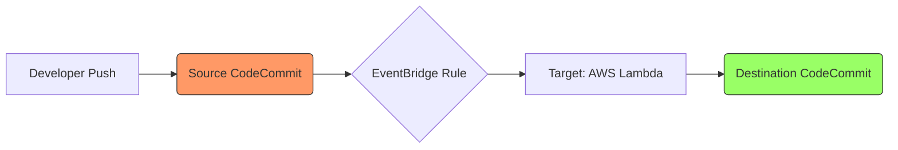

# AWS CodeCommit Advanced Hands-On: Monitoring with Amazon EventBridge

## 1. Introduction to Amazon EventBridge

**Amazon EventBridge** is a serverless event bus that makes it easy to connect applications using data from your own applications, integrated SaaS applications, and AWS services.

### Why use EventBridge for CodeCommit?
While CodeCommit has native **Triggers** and **Notifications**, EventBridge provides:
*   **Advanced Filtering**: Trigger actions only for specific branches, specific users, or specific types of PR comments.
*   **Multiple Targets**: Route a single event to multiple AWS services (e.g., Lambda, Step Functions, Firehose) simultaneously.
*   **Schema Registry**: Understand the structure of CodeCommit events easily.

---

## 2. Key Features of EventBridge Monitoring
*   **Decoupling**: Your repository doesn't need to "know" about the downstream systems.
*   **Reliability**: EventBridge handles retries and backoffs automatically.
*   **Cross-Account**: Events can be routed across AWS accounts.

---

## 3. Hands-On: Setting up a Monitoring Rule (UI Way)

In this example, we will monitor for **Pull Request status changes** and send an alert to an SNS topic.

1.  Navigate to the **Amazon EventBridge** console.
2.  Choose **Bus** -> **Rules** -> **Create rule**.
3.  **Name**: `MonitorCodeCommitPRs`.
4.  **Rule type**: **Rule with an event pattern**.
5.  **Event source**: **AWS services**.
6.  **Service name**: **CodeCommit**.
7.  **Event type**: **CodeCommit Pull Request State Change**.
8.  **Event pattern**: (Optional) You can edit the JSON to filter by specific repository ARNs.
9.  **Select Target(s)**:
    *   Target 1: **SNS topic**.
    *   Topic: Select your notification topic.
10. Click **Create rule**.

---

## 4. Hands-On: Setting up Monitoring (CLI Way)

### Step 1: Create the Rule
Create a rule that triggers whenever a branch or tag is created or deleted.

```bash
aws events put-rule \
    --name CodeCommitBranchMonitor \
    --event-pattern '{
        "source": ["aws.codecommit"],
        "detail-type": ["CodeCommit Repository State Change"],
        "detail": {
            "event": ["referenceCreated", "referenceDeleted"]
        }
    }' \
    --state ENABLED
```

### Step 2: Add a Target
Link the rule to a Lambda function to perform a specialized action.

```bash
aws events put-targets \
    --rule CodeCommitBranchMonitor \
    --targets "Id"="1","Arn"="arn:aws:lambda:us-east-1:123456789012:function:LogBranchEvent"
```

---

## 5. Summary Table: Native Triggers vs. EventBridge

| Feature | CodeCommit Triggers | Amazon EventBridge |
| :--- | :--- | :--- |
| **Logic Location** | Inside CodeCommit settings | Centralized Event Bus |
| **Filtered Events** | Basic (Push, PR) | Granular (Pattern matching) |
| **Complexity** | Simple / Fast | Enterprise / Robust |
| **Targets** | SNS, Lambda | 20+ AWS Services |

---

## 7. Migrating a Git Repository to AWS CodeCommit

Migrating an existing repository (from GitHub, GitLab, or a local server) to CodeCommit is a common task when moving workloads to AWS.

### Why Migrate? (Use Cases)
1.  **Unified Security**: Leverage **AWS IAM** for fine-grained access control instead of managing separate SSH keys or users on external platforms.
2.  **Compliance & Data Sovereignty**: Ensure your source code stays within your AWS region and meets specific regulatory requirements (e.g., SOC, HIPAA).
3.  **CI/CD Integration**: Seamlessly trigger **AWS CodePipeline** and **AWS CodeBuild** without needing complex webhook configurations or secret management for third-party tokens.
4.  **Network Security**: Keep your code strictly within a **VPC** using VPC Endpoints, preventing exposure to the public internet.
5.  **Cost**: For teams already using AWS, CodeCommit often falls within the free tier or is highly cost-effective compared to enterprise licenses of other tools.

---

## 8. Step-by-Step Migration Guide (The Mirror Method)

We recommend using the **Mirror** approach to ensure all branches, tags, and commit history are preserved.

### Step 1: Create the Destination Repository
Create a new, empty repository in AWS CodeCommit using the console or CLI:
```bash
aws codecommit create-repository --repository-name MyMigratedRepo
```

### Step 2: Clone the Source Repository
Perform a **bare clone** of your existing repository from the source (e.g., GitHub). This downloads strictly the Git metadata and history.
```bash
git clone --mirror https://github.com/username/my-source-repo.git
cd my-source-repo.git
```

### Step 3: Push to CodeCommit
Push the entire mirrored content to the new CodeCommit repository.
```bash
# Using HTTPS (GRC helper recommended)
git push codecommit://MyMigratedRepo --mirror
```
> [!NOTE]
> The `--mirror` flag ensures that all branches (master, develop, feature/*) and all tags (v1.0.0, etc.) are pushed exactly as they were in the source.

### Step 4: Verify and Cleanup
1.  Verify the files and history in the **AWS CodeCommit console**.
2.  Delete the temporary `.git` folder you created for migration:
    ```bash
    cd ..
    rm -rf my-source-repo.git
    ```
3.  **Clone the new repo** normally to start working:
    ```bash
    git clone codecommit://MyMigratedRepo
    ```

---

## 9. CodeCommit: Cross-Region Replication (CRR)

**Cross-Region Replication** is the process of automatically synchronizing your repository content from a source AWS region (e.g., `us-east-1`) to a destination region (e.g., `eu-west-1`).

Unlike Amazon S3, CodeCommit does not have a "one-click" replication button. It requires a serverless automation workflow to keep repositories in sync.

### Why & When to Use CRR?
1.  **Disaster Recovery (DR)**: If one AWS region experiences a major outage, your developers can immediately switch to the repository in the backup region.
2.  **Compliance & Data Locality**: Some regulations require a copy of source code to be stored in a geographically distinct location.
3.  **Latency Reduction**: For global teams, having a local mirror in a nearby region can slightly speed up read/clone operations.
4.  **Offsite Backup**: Serves as a live, versioned backup of your entire development history.

---

## 10. The Replication Flow (How it Works)

The architecture relies on **Amazon EventBridge** and **AWS Lambda**.



1.  **Event Generation**: A developer pushes code to the **Source Region**.
2.  **Event Capture**: An **EventBridge Rule** in the source region detects the `referenceCreated` or `referenceUpdated` event.
3.  **Automation Trigger**: EventBridge triggers a **Lambda Function**.
4.  **Sync Logic**: The Lambda function clones the repository from the source and pushes it to the **Destination Region** using the `--mirror` flag.

---

## 11. Sample EventBridge Event (CodeCommit)

When setting up your replication logic, your Lambda function will receive a JSON event like this:

```json
{
  "version": "0",
  "id": "12345678-1234-1234-1234-123456789012",
  "detail-type": "CodeCommit Repository State Change",
  "source": "aws.codecommit",
  "account": "123456789012",
  "time": "2024-01-01T12:00:00Z",
  "region": "us-east-1",
  "resources": [
    "arn:aws:codecommit:us-east-1:123456789012:MySourceRepo"
  ],
  "detail": {
    "event": "referenceUpdated",
    "repositoryName": "MySourceRepo",
    "repositoryId": "ba876543-2109-8765-4321-098765432109",
    "referenceType": "branch",
    "referenceName": "main",
    "referenceFullName": "refs/heads/main",
    "oldCommitId": "a1b2c3d4e5f6...",
    "newCommitId": "z9y8x7w6v5u4..."
  }
}
```

### Key Fields for Replication:
*   **`repositoryName`**: Used to identify which repo to sync.
*   **`referenceName`**: The specific branch or tag that was updated.
*   **`newCommitId`**: The latest point in history to pull.

---

## 12. Step-by-Step Implementation: Cross-Region Replication

Follow these steps to set up automated replication from **Source Region (e.g., us-east-1)** to **Destination Region (e.g., us-west-2)**.

### Step 1: Create the Destination Repository
Log into the **Destination Region** (us-west-2) and create an empty repository with the same name.
```bash
aws codecommit create-repository --repository-name MySourceRepo --region us-west-2
```

### Step 2: Create the Replication IAM Role
Create an IAM Role for your Lambda function with a policy that allows:
*   `codecommit:GitPull` on the source repository.
*   `codecommit:GitPush` on the destination repository.
*   `codecommit:Get*` and `codecommit:List*` on both.

### Step 3: Create the Replication Lambda Function
Create a Lambda function in the **Source Region**.
*   **Runtime**: Python or Node.js.
*   **Memory**: Higher memory (1GB+) is recommended for larger repos as Git operations happen in memory or `/tmp`.
*   **Timeout**: Increase to 5–15 minutes depending on repository size.
*   **Layer (CRITICAL)**: You must add a **Lambda Layer** that contains the `git` binary and the `git-remote-codecommit` helper, as these are not available by default in the Lambda environment.

**Conceptual Logic (Python):**
```python
import os
import subprocess
import shutil

def lambda_handler(event, context):
    repo_name = event['detail']['repositoryName']
    source_url = f"codecommit::{event['region']}://{repo_name}"
    dest_url = f"codecommit::us-west-2://{repo_name}"
    
    # Use /tmp for cloning
    os.chdir('/tmp')
    if os.path.exists(repo_name):
        shutil.rmtree(repo_name)

    # Mirror Clone and Mirror Push
    subprocess.run(['git', 'clone', '--mirror', source_url, repo_name])
    os.chdir(repo_name)
    subprocess.run(['git', 'push', '--mirror', dest_url])
    
    return {"status": "Replication Complete"}
```

### Step 4: Configure the EventBridge Rule
In the **Source Region** (us-east-1):
1.  Go to **EventBridge** -> **Rules** -> **Create Rule**.
2.  **Event Pattern**:
    ```json
    {
      "source": ["aws.codecommit"],
      "detail-type": ["CodeCommit Repository State Change"],
      "detail": {
        "event": ["referenceCreated", "referenceUpdated", "referenceDeleted"],
        "repositoryName": ["MySourceRepo"]
      }
    }
    ```
3.  **Target**: Select the **Lambda function** created in Step 3.

### Step 5: Test the Setup
1.  Push a new commit to your `main` branch in the source region.
2.  Check the Lambda function's **CloudWatch Logs** for execution success.
3.  Refresh the repository in the destination region console. You should see the new commit there.

---

## 13. AWS CodeCommit: Branch Security

**Branch Security** is the practice of restricting who can make changes to specific branches (like `main` or `production`) and under what conditions.

### What is it?
In a standard Git environment, anyone with push access can technically overwrite the entire history or delete the main branch. CodeCommit Branch Security uses **AWS IAM** to place "guardrails" around these branches.

### Why & When to use it?
*   **Why**: To prevent accidental deletion of code, ensure all code is reviewed (Quality Control), and meet compliance requirements (Audit Trails).
*   **When**:
    *   Protecting the **Production** branch from "cowboy coding" (direct pushes).
    *   Protecting a **Release** branch during a code freeze.
    *   Ensuring only a specific Lead Developer can merge to `main`.

### Examples of Branch Security
1.  **Direct Push Prevention**: Developers cannot run `git push origin main`. They must create a Pull Request.
2.  **Branch Deletion Protection**: No one, including admins, can delete the `main` branch without a specific override.
3.  **Merge Restrictions**: A PR can only be merged if it has passed established CI tests (like CodeBuild) and has been approved by a manager.

---

## 14. Achieving High Security: Step-by-Step

To achieve maximum security for your sensitive branches, follow these three layers of protection.

### Step 1: Apply a "Deny" IAM Policy (Branch Protection)
The strongest way to protect a branch is to explicitly **Deny** the `GitPush` and `DeleteBranch` actions for that specific branch.

**Sample Policy:**
```json
{
    "Version": "2012-10-17",
    "Statement": [
        {
            "Effect": "Deny",
            "Action": [
                "codecommit:GitPush",
                "codecommit:DeleteBranch"
            ],
            "Resource": "arn:aws:codecommit:us-east-1:123456789012:MyRepo",
            "Condition": {
                "StringLike": {
                    "codecommit:references": [
                        "refs/heads/main",
                        "refs/heads/prod"
                    ]
                }
            }
        }
    ]
}
```

### Step 2: Use Approval Rule Templates
Approval rules ensure that code is reviewed before it can be merged into a protected branch.

1.  Navigate to **CodeCommit** -> **Approval rule templates**.
2.  Click **Create template**.
3.  **Number of approvals**: Set to `1` or `2`.
4.  **Associated Repositories**: Link it to your repo.
5.  **Branch filters**: Set to `main`.
*   *Result*: Any PR targeting `main` will now be locked until authorized users click "Approve."

### Step 3: MFA-Protected Actions
For extremely sensitive branches (e.g., Finance or Security code), you can add a condition to your IAM policy that requires **Multi-Factor Authentication (MFA)** to be active before a push is allowed.

---

## 15. AWS CodeCommit: Pull Request Approval Rules

**Pull Request (PR) Approval Rules** are requirements that must be met before a pull request can be merged into a branch.

### How it Helps (Why we use it)
*   **Enforce Code Quality**: Ensures that at least one (or more) senior developers or peers have reviewed the code for bugs or architectural alignment.
*   **Security Compliance**: Prevents unauthorized or malicious code from entering sensitive branches.
*   **Automated Guardrails**: Blocks the "Merge" button automatically if the conditions are not satisfied.

### What & When?
*   **What**: A rule defines the number of required approvals and optionally the users/roles authorized to approve.
*   **When**: Use them for every PR targeting a protected branch (like `main`, `master`, or `release`).

---

## 16. Approval Rule Templates (Automation)

While you can create a rule for a single PR, **Approval Rule Templates** allow you to automatically apply these rules to **every new PR** created in specific repositories.

### The Workflow
1.  **Create Template**: Define the approval logic once.
2.  **Associate**: Link the template to one or more repositories.
3.  **Automation**: Every time a developer creates a PR in those repositories, the rule is automatically attached.

---

## 17. Step-by-Step Configuration

### Method 1: Using the AWS Console (UI)
1.  Go to **CodeCommit** -> **Approval rule templates**.
2.  Click **Create template**.
3.  **Template name**: `SeniorDevReviewRequired`.
4.  **Number of approvals**: `1`.
5.  **Approval pool members** (Optional): Specify IAM users or roles authorized to approve.
6.  **Associated repositories**: Select your repository.
7.  **Branch filters**: Enter `refs/heads/main`.
8.  Click **Create**.

### Method 2: Using the AWS CLI
**1. Create the template:**
```bash
aws codecommit create-approval-rule-template \
    --approval-rule-template-name "TwoSeniorApprovals" \
    --approval-rule-template-content "{
        \"Version\": \"2018-11-08\",
        \"DestinationReferences\": [\"refs/heads/main\"],
        \"Statements\": [{
            \"Type\": \"Approvers\",
            \"NumberOfApprovalsNeeded\": 2
        }]
    }"
```

**2. Associate the template with a repository:**
```bash
aws codecommit associate-approval-rule-template-with-repository \
    --approval-rule-template-name "TwoSeniorApprovals" \
    --repository-name "MyRepo"
```

---

## 18. Conclusion
By combining **Mirror Migration**, **Cross-Region Replication**, strict **Branch Security**, and automated **Approval Rules**, you can build a highly resilient, enterprise-grade version control system entirely on AWS.
