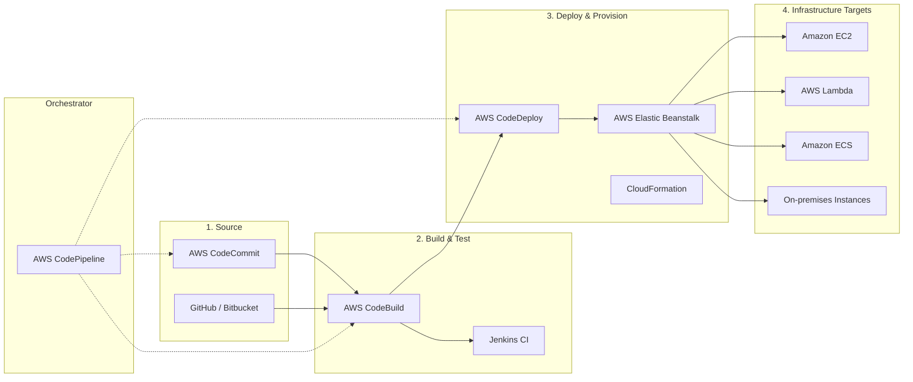
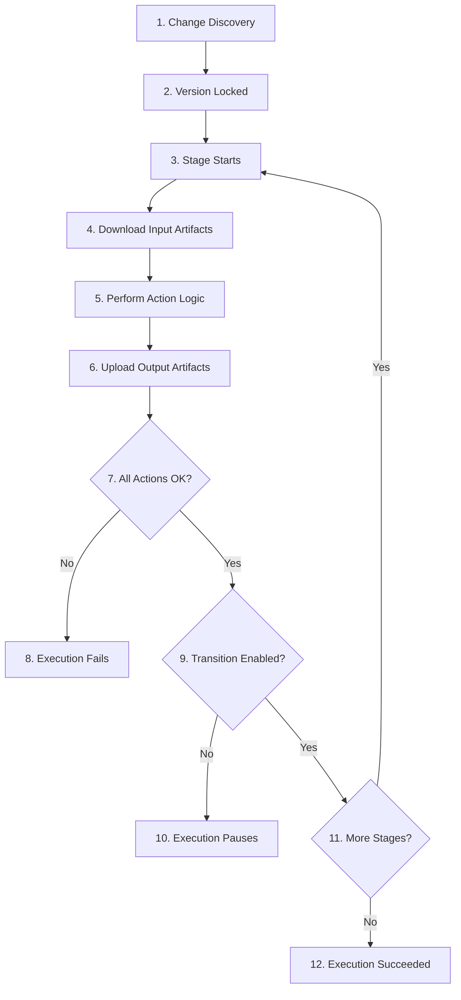

# AWS CodePipeline: In-Depth Guide

AWS CodePipeline is a fully managed continuous delivery service that helps you automate your release pipelines for fast and reliable application and infrastructure updates.

---

## 1. Introduction to AWS CodePipeline

CodePipeline automates the build, test, and deploy phases of your release process every time there is a code change, based on the release model you define.

### Continuous Delivery vs. Continuous Deployment
*   **Continuous Delivery (CD)**: The pipeline automates the release process up to a staging environment, but requires a **manual approval** before deploying to production.
*   **Continuous Deployment**: Every change that passes all stages of your production pipeline is released to your customers automatically. No human intervention is needed.

---

## 2. Technology Stack for CI/CD

To build a complete CI/CD pipeline on AWS, you use a combination of native services and third-party tools.

### 2.1 High-Level Architecture


### 2.2 Functional Breakdown
The following flowchart illustrates how these technologies interact across the different phases of the software development lifecycle:



### 2.3 Component Roles
*   **Orchestration (AWS CodePipeline)**: The "brain" that connects all stages and moves artifacts automatically.
*   **Code (Source)**: Where developers push their code. Options include AWS-native **CodeCommit** or 3rd-party providers like **GitHub** or **Bitbucket**.
*   **Build & Test**: Compiles code and runs quality checks. **AWS CodeBuild** is serverless, while **Jenkins** is a popular self-managed alternative.
*   **Deploy**: Pushes the built artifact to the target environment. **CodeDeploy** handles rolling updates, while **Elastic Beanstalk** provides a platform-as-a-service (PaaS) experience.
*   **Provisioning**: Creating the underlying infrastructure (EC2, Lambda, ECS) using services like **CloudFormation** or Terraform.

### 2.1 Stages (In-Depth)
A stage is the primary organizational unit of a pipeline. It defines a set of actions to be performed on the code.

#### Key Rules & Constraints
*   **Minimum Structure**: A pipeline must contain at least **two stages**.
*   **Source Stage**: The **first stage** in every pipeline must be a Source stage (at least one source action).
*   **Naming**: Each stage in a pipeline must have a unique name.
*   **Workflow**: Once a stage completes successfully, the produced artifacts flow to the next stage via **Transitions**.

#### Stage Transitions
Transitions are the bridges between stages. 
*   **Enabling/Disabling**: You can manually disable a transition to prevent a pipeline execution from moving to the next stage.
*   **Use Cases**: 
    *   Protecting production during a maintenance window.
    *   Preventing automated deployments after a failed test in a previous stage until a manual fix is applied.
*   **State Persistence**: If a transition is disabled, any execution that reaches it will wait. Once re-enabled, the latest execution will proceed (Superseded logic applies).

#### Action Execution Logic within a Stage
Inside a single stage, you can control the order of actions using the `RunOrder` parameter.
*   **Sequential Actions**: Actions with different `RunOrder` values run one after the other.
*   **Parallel Actions**: Actions with the **same `RunOrder`** value run simultaneously.
    *   *Example*: Running `UnitTests` and `StyleLint` in parallel to save time.
*   **Artifact Dependencies**: An action won't start until its required input artifacts (produced by previous actions/stages) are available.

### 2.2 Actions
An action is a task performed on an artifact in a stage.
*   **Sequential Actions**: Actions that run one after another in a stage.
*   **Parallel Actions**: Actions that run at the same time in a stage (e.g., running unit tests and linting simultaneously).

### 2.3 Artifacts (In-Depth)
**Artifacts** are the files, bundles, or data processed by the pipeline actions. Think of them as the "cargo" that the pipeline "train" carries between stops (stages).

#### Input vs. Output Artifacts
Each action in a pipeline can produce one or more output artifacts and consume one or more input artifacts.
*   **Example**:
    1.  The `Source` stage produces an **Output Artifact** named `SourceArtifact` (the zipped code from CodeCommit).
    2.  The `Build` stage consumes `SourceArtifact` as an **Input Artifact**, compiles it, and produces a new **Output Artifact** named `BuildArtifact` (the compiled binary).
    3.  The `Deploy` stage then consumes `BuildArtifact` as its **Input Artifact**.

#### The Artifact Store (S3 Storage)
Artifacts are not stored "inside" the pipeline; they are stored in a dedicated **Amazon S3 bucket** created by CodePipeline when you first set it up.
*   **Structure**: CodePipeline organizes the bucket using a naming convention: `s3://codepipeline-<region>-<random-id>/<PipelineName>/<ArtifactName>/<hash>.zip`.
*   **Auto-Cleaning**: CodePipeline manages the lifecycle of these files, but it's a best practice to periodically clean up old versions or use S3 lifecycle policies to save costs.
*   **Temporary Usage**: During an action (like CodeBuild), the artifact is downloaded from S3, unzipped into the environment, modified, re-zipped, and uploaded back to S3 as a new output artifact.

#### Security & Encryption (AWS KMS)
CodePipeline ensures that artifacts are secure at rest and in transit.
*   **Encryption at Rest**: Every artifact uploaded to the S3 bucket is automatically encrypted.
*   **KMS Keys**:
    *   **Default S3 Key (AES-256)**: Used by default for single-account pipelines.
    *   **Customer Managed Key (CMK)**: **Required** for cross-account pipelines. This ensures that the destination account has permission to decrypt the artifacts produced in the source account.
*   **Access Control**: CodePipeline uses its **Service Role** to interact with the S3 bucket and KMS keys. You must ensure the S3 bucket policy and KMS key policy allow access to this role.

### 2.4 Transitions
Transitions connect stages. You can **disable a transition** to stop the pipeline from progressing to the next stage (e.g., during a maintenance window).

---

---

## 3. Action Types & Artifact Constraints

AWS CodePipeline supports several categories of actions. Each action has specific constraints on the number of **Input** and **Output** artifacts it can handle.

### 3.1 Action Categories & Popular Providers

| Category | Description | Popular Providers |
| :--- | :--- | :--- |
| **Source** | Fetches the code/data from a repository or bucket. | CodeCommit, S3, GitHub, Bitbucket, ECR. |
| **Build** | Compiles, builds, or analyzes code. | CodeBuild, Jenkins, CloudBees. |
| **Test** | Runs automated tests. | CodeBuild, Device Farm, Ghost Inspector. |
| **Deploy** | Deploys the built artifact to a target. | CodeDeploy, ECS, S3, CloudFormation, Elastic Beanstalk. |
| **Approval** | Pauses for human review/validation. | Manual Approval (SNS notification). |
| **Invoke** | Triggers automated custom logic. | AWS Lambda. |

### 3.2 Artifact Constraints Table

This table details the official artifact limits for common AWS-owned action providers.

| Category | Provider | Owner | Valid Input Artifacts | Valid Output Artifacts |
| :--- | :--- | :--- | :--- | :--- |
| **Source** | CodeCommit | AWS | 0 | 1 |
| **Source** | S3 | AWS | 0 | 1 |
| **Source** | GitHub (v1/v2) | Third-Party | 0 | 1 |
| **Source** | ECR | AWS | 0 | 1 |
| **Build** | CodeBuild | AWS | 1 - 5 | 0 - 5 |
| **Test** | CodeBuild | AWS | 1 - 5 | 0 - 5 |
| **Test** | Device Farm | AWS | 1 | 0 |
| **Deploy** | CodeDeploy | AWS | 1 | 0 |
| **Deploy** | Elastic Beanstalk | AWS | 1 | 0 |
| **Deploy** | ECS (Blue/Green) | AWS | 1 - 10 | 0 |
| **Deploy** | CloudFormation | AWS | 1 - 10 | 0 - 1 |
| **Deploy** | S3 | AWS | 1 | 0 |
| **Invoke** | Lambda | AWS | 0 - 5 | 0 - 5 |
| **Approval** | Manual | AWS | 0 | 0 |

---

### 3.3 In-Depth: Manual Approval Flow

A **Manual Approval** action is a strategic "human-in-the-loop" gatekeeper. It is typically used to ensure that code changes meet quality standards or business requirements before being deployed to sensitive environments like **Production**.

#### The Operational Lifecycle

1.  **Pause (Suspension)**: When a pipeline execution reaches a stage containing a manual approval action, it **pauses**. The action status changes to **Awaiting approval**, and the pipeline transition to the next action/stage is blocked.
2.  **Notification (Optional but Recommended)**: If an **Amazon SNS topic** is configured, CodePipeline sends a notification to that topic. This can trigger emails, SMS, or Slack alerts to notify the relevant stakeholders (e.g., QA Lead or DevOps Manager).
3.  **Review**: The authorized approvers log into the AWS Console. They can view the output of previous stages (e.g., test results, build logs) using the **URL to review** provided in the action configuration.
4.  **The Decision (Outcome)**:
    *   **Approve**: The approver provides an optional comment and clicks **Approve**. The execution status changes to **Succeeded**, and the pipeline resumes by moving to the next action or stage.
    *   **Reject**: The approver provides a comment (often mandatory for rejection) and clicks **Reject**. The execution status changes to **Failed**, and the entire pipeline execution stops immediately.

#### Key Configuration Elements

*   **SNS Topic ARN**: The ARN of the SNS topic to which notifications are sent.
*   **External Entity to Review**: A URL (e.g., a link to a staging site, a Jira ticket, or a code review tool) that the approver uses to make their decision.
*   **Custom Comments**: A text field where the approver can document their rationale for approval or rejection.

#### Security & Permissions
To act on a manual approval, a user or role must have the `codepipeline:PutApprovalResult` permission in their IAM policy. Without this, they will be unable to click the "Approve" or "Reject" buttons in the console.

---

### 3.4 AWS CloudFormation as a Deployment Target

AWS CloudFormation allows you to manage your infrastructure as code (IaC). Integrating it with CodePipeline enables fully automated, predictable infrastructure updates.

#### 1. Action Modes (The "How")
CloudFormation actions in CodePipeline can operate in several "modes" depending on your safety and automation needs:

*   **CREATE_UPDATE (Standard)**: Automatically creates the stack if it doesn't exist or updates it if it does. This is the fastest but least "safe" mode for production.
*   **REPLACE_ON_FAILURE**: Similar to `CREATE_UPDATE`, but if the stack creation fails, it deletes the stack and tries again. Useful for development environments where you want to "fail fast" and retry.
*   **CHANGE_SET_CREATE**: Generates a **Change Set** (a preview of what will happen) but does **not** apply it. This is the first half of the "Safe Deployment" pattern.
*   **CHANGE_SET_EXECUTE**: Applies a previously created Change Set. This is the second half of the pattern.
*   **DELETE_ONLY**: Deletes a specific stack.

#### 2. The Recommended Flow: The Change Set Pattern
For production environments, the industry standard is to use a "Review and Approve" flow:
1.  **Source Stage**: Fetch the CloudFormation template and configuration files.
2.  **Generate Change Set Stage**: Use `CHANGE_SET_CREATE`. This generates a summary of added/modified/deleted resources.
3.  **Manual Approval Stage**: A human reviews the Change Set in the CloudFormation console to ensure no accidental deletions occur.
4.  **Execute Change Set Stage**: Use `CHANGE_SET_EXECUTE` to apply the approved changes.

#### 3. Template Parameter Overrides
You often need to pass different values to your template depending on the environment (e.g., `InstanceType=t2.micro` for Dev vs `t3.large` for Prod).

*   **Mechanism**: You provide a JSON object in the **Parameter overrides** field of the action configuration.
*   **Syntax**: 
    ```json
    {
      "InstanceType": "t3.small",
      "VpcId": { "Ref" : "MySourceArtifact::VpcId" },
      "EnvName": "Production"
    }
    ```
*   **Dynamic Variables**: You can use the `{ "Ref": "ArtifactName::VariableName" }` syntax to pull values from output artifacts or pipeline variables (like the `ExecutionId`) directly into your CloudFormation templates.

---

### 3.5 The Invoke Action: Custom Automation with AWS Lambda

The **Invoke** action allows you to trigger an AWS Lambda function as a stage in your pipeline. This is the "Swiss Army Knife" of CodePipeline, enabling any custom logic that isn't handled by native providers.

#### 1. The Technical "Handshake"
When CodePipeline triggers a Lambda function, it passes a JSON `event` object containing `JobData`. 

*   **Crucial Rule**: Unlike other services, CodePipeline **will wait forever** (or until the action timeout) for the Lambda function to signal its status. 
*   **The Callback**: Your Lambda code **must** explicitly call the CodePipeline API (`PutJobSuccessResult` or `PutJobFailureResult`) to tell the pipeline whether it should proceed or fail. If you forget this, the pipeline will hang.

#### 2. Workflow & Implementation Steps

**Step 1: IAM Role for Lambda**
Your Lambda function's execution role must have permissions to communicate back to CodePipeline.
```json
{
    "Version": "2012-10-17",
    "Statement": [
        {
            "Action": [
                "codepipeline:PutJobSuccessResult",
                "codepipeline:PutJobFailureResult"
            ],
            "Resource": "*",
            "Effect": "Allow"
        }
    ]
}
```

**Step 2: Lambda Function Code (Python Example)**
Your function must parse the `jobId` and send the success/failure result.
```python
import boto3

def lambda_handler(event, context):
    cp = boto3.client('codepipeline')
    job_id = event['CodePipeline.job']['id']
    
    try:
        # 1. Retrieve User Parameters (if any)
        params = event['CodePipeline.job']['data']['actionConfiguration']['configuration']['UserParameters']
        
        # 2. Perform your custom logic (e.g., API call, cleanup)
        print(f"Executing custom logic with params: {params}")
        
        # 3. Signal Success
        cp.put_job_success_result(jobId=job_id)
        
    except Exception as e:
        # 4. Signal Failure with error message
        cp.put_job_failure_result(
            jobId=job_id,
            failureDetails={'message': str(e), 'type': 'JobFailed'}
        )
```

**Step 3: Configure the Pipeline Action**
*   **Action Provider**: AWS Lambda.
*   **Function Name**: Select your function.
*   **User Parameters**: Provide any static data or variables in JSON/String format that your Lambda needs to read.

#### 3. Common Use Cases
*   **Third-Party Integrations**: Triggering a deployment in an external system (e.g., Jira, ServiceNow, or a private server).
*   **Custom Notifications**: Sending a pre-formatted message to Slack using Webhooks.
*   **Infrastructure Tasks**: Rotating secrets in Secrets Manager or updating a Route 53 record after a deployment.
*   **Quality Gates**: Calling an external API to check if a performance test or security scan passed.

#### 4. Limitations
*   **Timeout**: Lambda has a maximum execution time of **15 minutes**. If your task takes longer, you should use the Lambda to trigger an asynchronous process (like an ECS Task) and use a separate mechanism to notify the pipeline.
*   **Payload Size**: The event data passed to Lambda has size limits; for large data, use S3 artifacts instead.

---

> [!IMPORTANT]
> - **Source Actions** never take input artifacts because they are the starting point of the pipeline.
> - **Build and Invoke actions** (CodeBuild/Lambda) are the most flexible, allowing up to 5 input and output artifacts, which is useful for complex merging or multi-service notification logic.

---

### 3.6 Artifacts (In-Depth)
**Artifacts** are the files, bundles, or data processed by the pipeline actions. Think of them as the "cargo" that the pipeline "train" carries between stops (stages).

#### Input vs. Output Artifacts
Each action in a pipeline can produce one or more output artifacts and consume one or more input artifacts.
*   **Example**:
    1.  The `Source` stage produces an **Output Artifact** named `SourceArtifact` (the zipped code from CodeCommit).
    2.  The `Build` stage consumes `SourceArtifact` as an **Input Artifact**, compiles it, and produces a new **Output Artifact** named `BuildArtifact` (the compiled binary).
    3.  The `Deploy` stage then consumes `BuildArtifact` as its **Input Artifact**.

#### The Artifact Store (S3 Storage)
Artifacts are not stored "inside" the pipeline; they are stored in a dedicated **Amazon S3 bucket** created by CodePipeline when you first set it up.
*   **Structure**: CodePipeline organizes the bucket using a naming convention: `s3://codepipeline-<region>-<random-id>/<PipelineName>/<ArtifactName>/<hash>.zip`.
*   **Auto-Cleaning**: CodePipeline manages the lifecycle of these files, but it's a best practice to periodically clean up old versions or use S3 lifecycle policies to save costs.
*   **Temporary Usage**: During an action (like CodeBuild), the artifact is downloaded from S3, unzipped into the environment, modified, re-zipped, and uploaded back to S3 as a new output artifact.

#### Security & Encryption (AWS KMS)
CodePipeline ensures that artifacts are secure at rest and in transit.
*   **Encryption at Rest**: Every artifact uploaded to the S3 bucket is automatically encrypted.
*   **KMS Keys**:
    *   **Default S3 Key (AES-256)**: Used by default for single-account pipelines.
    *   **Customer Managed Key (CMK)**: **Required** for cross-account pipelines. This ensures that the destination account has permission to decrypt the artifacts produced in the source account.
*   **Access Control**: CodePipeline uses its **Service Role** to interact with the S3 bucket and KMS keys. You must ensure the S3 bucket policy and KMS key policy allow access to this role.

---

## 4. Pipeline Execution & Triggers

### 4.1 In-Depth Trigger Mechanisms

CodePipeline needs a way to discover code changes to start an execution. There are three primary methods:

#### 1. Amazon EventBridge (Modern & Recommended)
This is the modern, event-driven standard for AWS-native and modern third-party source integrations.
*   **How it works**: When a developer pushes code (e.g., to CodeCommit) or an object is uploaded to S3, the service emits a "Change" event. **Amazon EventBridge** detects this event based on a rule and immediately signals CodePipeline to start.
*   **Pros**: Near-instant execution (lowest latency), highly efficient (no idle checks), and minimizes API calls.
*   **Usage**: Default for CodeCommit, Amazon S3, and GitHub (v2/Connections).

#### 2. Webhooks (Push-based)
Webhooks are used primarily for third-party source providers like GitHub (v1) or Bitbucket.
*   **How it works**: CodePipeline provides an HTTP endpoint. When a push occurs in the external repository, the provider sends an **HTTP POST request** (the webhook) directly to that endpoint.
*   **Pros**: Faster than polling, doesn't require AWS-native event integration.
*   **Cons**: Requires managing secret tokens for security; legacy support for older GitHub integrations.

#### 3. Polling (Periodic Checks)
This is a legacy discovery method where CodePipeline actively "asks" the source provider if anything has changed.
*   **How it works**: CodePipeline periodically (usually every 1 minute) calls the provider's API to check for a new commit or version.
*   **Pros**: Extremely simple to set up as it requires no extra rules or endpoints.
*   **Cons**: High latency (up to 1-minute delay), inefficient, and can lead to API rate-limiting issues in large environments.
*   **Note**: Not recommended for production pipelines.

#### Comparison Table: Trigger Methods

| Feature | Amazon EventBridge | Webhooks | Polling |
| :--- | :--- | :--- | :--- |
| **Type** | Event-driven (Push) | External Push | Periodic Pull |
| **Latency** | Near-instant | Very Low | Up to 1 minute |
| **Efficiency** | High | High | Low |
| **AWS Recommended**| Yes (Best Practice) | Yes (for 3rd Party) | No (Legacy) |
| **Primary Use** | CodeCommit, S3, GitHub v2 | GitHub v1, Bitbucket | S3 (Legacy) |

### 4.2 Execution Modes
*   **SUPERSEDED (Default)**: If a second execution starts while the first is in progress, the second one "jumps" ahead and replaces the first one at the entry of the next stage.
*   **QUEUED**: Multiple executions run one by one in the order they were triggered.
*   **PARALLEL**: Multiple executions run independently through the pipeline.

### 4.3 Pipeline Execution Lifecycle (The Flow)

Every time a change is detected, CodePipeline orchestrates a structured lifecycle. Understanding this flow is critical for troubleshooting and optimization.

#### 1. Initiation (Stage 0: The Trigger)
*   **Discovery**: One of the trigger mechanisms (EventBridge, Webhook, or Polling) detects a change in the source.
*   **Version Pinning**: Once a pipeline execution starts, it is "pinned" to the specific version of the source (e.g., a specific commit ID). This ensures consistency as it moves through the stages.

#### 2. Processing (Stage Execution)
For each stage in the pipeline, the following sub-flow occurs:
*   **Action Start**: CodePipeline identifies the actions to run based on their `RunOrder`.
*   **Input Retrieval**: The action provider (e.g., CodeBuild) downloads the required **Input Artifact** from the S3 Artifact Store.
*   **Action Logic**: The provider performs its task (compiling, testing, deploying).
*   **Output Upload**: If successful, the action uploads its results as a new **Output Artifact** to the S3 bucket.

#### 3. Transitioning (The Handshake)
*   **Stage Success**: A stage is considered "Succeeded" only when all its mandatory actions (and action groups) complete successfully.
*   **Automatic Transition**: By default, CodePipeline immediately triggers the next stage upon success.
*   **Failure Protection**: If an action fails, the execution stops immediately, and the transition to the next stage is blocked.

#### 4. Visual Execution Flow


### 4.4 Deep Dive: Amazon EventBridge Integration

Amazon EventBridge is the event-driven "glue" that connects CodePipeline to the rest of AWS. It acts as both a **Trigger** (Inbound) and a **Monitor** (Outbound).

#### 1. Inbound: How EventBridge Triggers the Pipeline
When you select "Amazon EventBridge" as your detection method, CodePipeline automatically creates a rule in EventBridge.

*   **Mechanism**: The rule monitors the source provider (e.g., CodeCommit) for specific events like `ReferenceCreated` or `ReferenceUpdated`.
*   **Sample Event Pattern (CodeCommit)**:
    ```json
    {
      "source": ["aws.codecommit"],
      "detail-type": ["CodeCommit Repository State Change"],
      "resources": ["arn:aws:codecommit:us-east-1:123456789012:MyRepo"],
      "detail": {
        "event": ["referenceCreated", "referenceUpdated"],
        "referenceType": ["branch"],
        "referenceName": ["main"]
      }
    }
    ```
*   **Target**: The EventBridge rule points to your pipeline's ARN as the target and uses a specific IAM role to call `codepipeline:StartPipelineExecution`.

#### 2. Outbound: CodePipeline as an Event Source
CodePipeline itself emits events at three levels, which you can use to trigger downstream automation:

1.  **Pipeline Level**: When the entire execution starts, succeeds, or fails.
2.  **Stage Level**: When a specific stage (e.g., `Production`) starts or completes.
3.  **Action Level**: When an individual action (e.g., `DeployToProd`) finishes.

#### 3. Advanced Automation Use Cases
*   **Custom Notifications**: Instead of simple SNS emails, trigger a **Lambda function** that formats a rich message for Slack or Microsoft Teams, including the commit message and the author's name.
*   **Cross-Account Triggers**: An EventBridge rule in Account A can detect a change and trigger a pipeline in Account B (Cross-Account Event Bus).
*   **Auto-Cleanup**: Trigger a Lambda function on `Pipeline Execution FAILED` to automatically delete any temporary resources or environments created during the execution.

#### 4. Security Requirement: Trust Relationship
For EventBridge to trigger your pipeline, the IAM role used by the rule must have a **Trust Policy** allowing the `events.amazonaws.com` service to assume it.

---

## 5. Advanced Features

### 5.1 Variables
You can pass variables between actions. For example, a version number generated in the `Build` stage can be used as a parameter in the `Deploy` stage.

### 5.2 Cross-Region Pipelines
You can have a pipeline in `us-east-1` that deploys to `eu-west-1`. CodePipeline handles the cross-region artifact replication automatically.

### 5.3 Cross-Account Pipelines
A pipeline in Account A can deploy resources into Account B. This requires setting up cross-account IAM roles and S3 bucket policies.

---

---

## 5. AWS CodePipeline Best Practices

To build reliable, secure, and efficient delivery pipelines, follow these industry-standard best practices.

### 5.1 Security & IAM
*   **Principle of Least Privilege**: Never use a single IAM role for all pipelines. Create a dedicated **Service Role** for each pipeline and restrict its permissions to only the resources (S3 buckets, CodeBuild projects) it needs.
*   **Cross-Account Security**: When deploying across accounts, use **Customer Managed Keys (CMKs)** in AWS KMS instead of default keys. This allows you to grant the cross-account role permission to decrypt artifacts.
*   **VPC Connectivity**: For security-sensitive workloads, run your CodeBuild actions within a **VPC** to ensure traffic to your internal resources doesn't cross the public internet.

### 5.2 Artifact Management
*   **S3 Lifecycle Policies**: CodePipeline generates many artifacts over time. Configure lifecycle policies on your artifact S3 bucket to move old versions to cheaper storage (Glacier) or delete them after 30-60 days to save costs.
*   **Artifact Encryption**: Ensure that "Encryption at rest" is always enabled for your artifact store.
*   **Immutability**: Treat artifacts as immutable. Once a build produces an artifact, that specific version should be promoted through all stages without modification to ensure parity between Dev and Prod.

### 5.3 Monitoring & Observability
*   **Event-Driven Alerts**: Use **Amazon EventBridge** to detect pipeline state changes (e.g., `FAILED`, `CANCELLED`). Route these events to an **SNS topic** to send real-time notifications to Slack, Microsoft Teams, or email.
*   **CloudWatch Metrics**: Monitor the `Duration` and `FailedCount` metrics in CloudWatch. If a pipeline's execution time suddenly increases, it may indicate a bottleneck in your build or test scripts.
*   **Audit Logging**: Enable **AWS CloudTrail** to log all API calls made by and to CodePipeline. This is essential for security auditing and compliance.

### 5.4 Pipeline Architecture
*   **Fail Fast**: Place unit tests and security scans (linting, SAST) in the earliest possible stages of the pipeline. If a commit breaks the build, find out in seconds, not minutes.
*   **Parallel Execution**: Use the `RunOrder` parameter to run independent actions (like parallel unit tests) simultaneously. This significantly reduces the total cycle time.
*   **Manual Approvals**: Always include a manual approval gate before deploying to **Production**. This allows for a final "sanity check" and prevents accidental releases during critical business hours.
*   **One Source, Multiple Targets**: Design your pipeline to build the application **once** and deploy the same artifact to multiple environments (Dev, QA, Prod). This ensures that what you tested is exactly what you ship.

### 5.5 Advanced Deployment Strategies
*   **Blue/Green Deployments**: Instead of updating instances in place, use CodeDeploy or Elastic Beanstalk to shift traffic from an old version (Blue) to a new version (Green). This allows for near-zero downtime and instant rollbacks.
*   **Canary Releases**: Deploy changes to a small subset of users first. Monitor for errors, and if stable, roll out to the rest of the fleet.

---

## 6. Conclusion
AWS CodePipeline is the "orchestrator" of the AWS CI/CD suite. It doesn't perform build or deploy tasks itself, but it manages the flow of artifacts and the execution of other services like CodeBuild and CodeDeploy.
